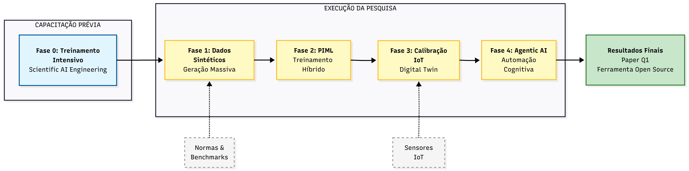
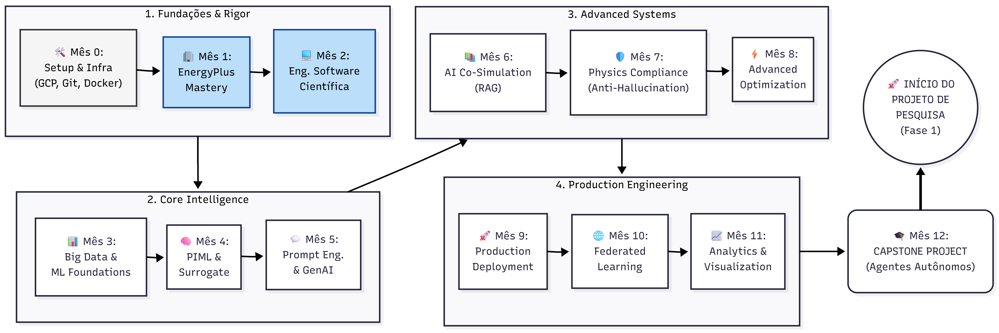
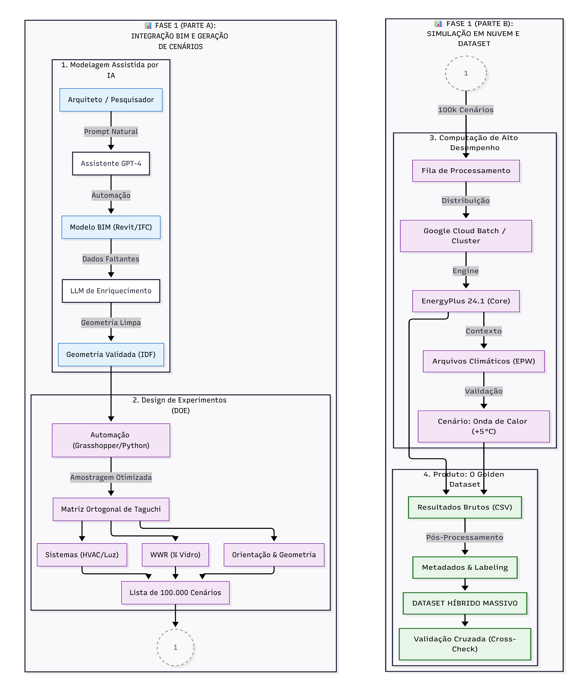
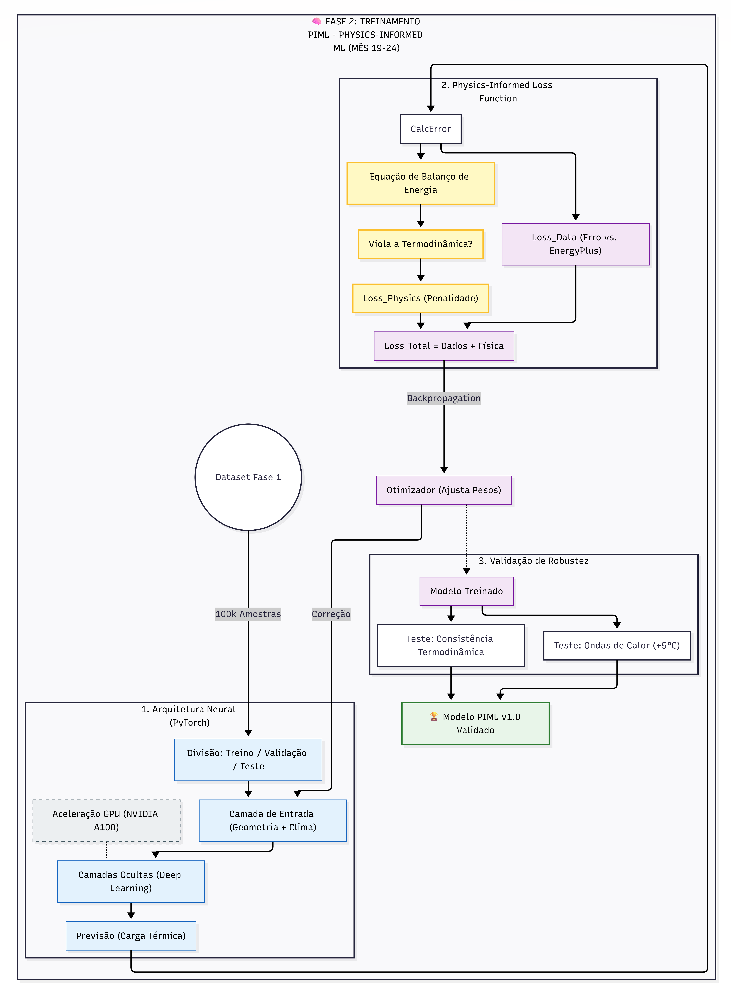
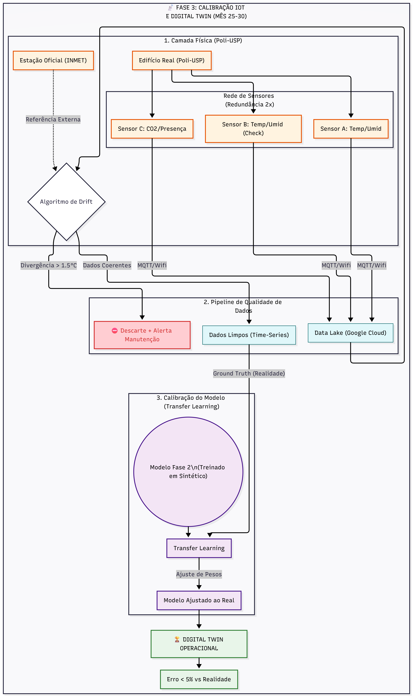
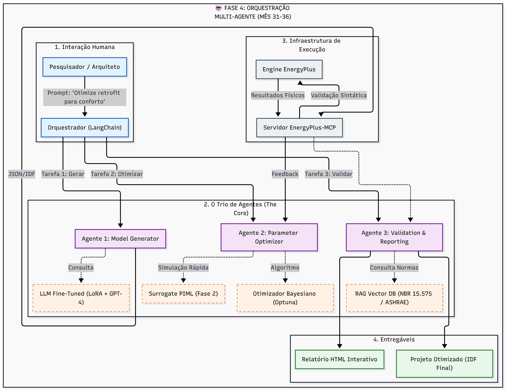

# **PROJETO DE PESQUISA**

Modalidade: AUXÍLIO À PESQUISA REGULAR (FAPESP)

**Título do Projeto**  
Integração de Machine Learning e Physics-Informed ML na Simulação de Desempenho de Edifícios: Superando Limitações de Escala e Incerteza em Climas Tropicais

**Pesquisador Responsável**  
João Petreche

**Instituição Sede**  
Escola Politécnica – Departamento de Engenharia de Construção Civil

**Duração Proposta**  
48 Meses (12 meses de capacitação intensiva + 36 meses de pesquisa)

## **1. Resumo**

A Simulação de Desempenho de Edifícios (BPS) é fundamental para a eficiência energética, mas métodos tradicionais enfrentam barreiras computacionais severas em análises de escala urbana e otimização estocástica. Este projeto propõe o desenvolvimento e validação de Surrogate Models (modelos substitutos) baseados em Machine Learning (ML) para superar tais limitações. O objetivo é duplo: (1) Criar modelos de previsão de carga térmica e conforto utilizando algoritmos de Gradient Boosting (XGBoost) e Physics-Informed ML (PIML), treinados em datasets sintéticos massivos e calibrados com dados de IoT; e (2) Estabelecer um protocolo de atualização tecnológica para o Departamento de Engenharia de Construção Civil (PCC), introduzindo fluxos de trabalho automatizados por Agentic AI.

A metodologia adota um modelo estratégico de capacitação prévia: **12 meses de treinamento intensivo puro (MÊS 1-12)** seguidos por **36 meses de execução de pesquisa (MÊS 13-48)**. Esta separação deliberada garante que toda a equipe esteja completamente capacitada em Scientific AI Engineering, EnergyPlus, PIML e LLM/Agentic AI antes da complexidade da execução do projeto, maximizando eficiência e qualidade científica.

A metodologia inova ao focar na validação em climas tropicais úmidos — uma lacuna crítica apontada por Wang et al. (2025) — e na mitigação de riscos de incerteza estocástica através de abordagens probabilísticas. A equipe é multidisciplinar, integrando expertise em Física de Edifícios (João Petreche, Brenda Leite) com a liderança em Big Data/IoT (Fabiano Corrêa) e Modelagem BIM (Eduardo Toledo).

## **2. Enunciado do Problema e Justificativa**

A literatura recente aponta que o custo computacional das simulações físicas detalhadas (EnergyPlus/OpenStudio) inviabiliza a análise de múltiplas variantes de projeto em escala urbana (Villano et al., 2024). Embora modelos puramente orientados a dados (black-box) ofereçam velocidade, eles frequentemente falham em garantir consistência física em cenários não vistos durante o treinamento (Tian, 2024).

A fronteira do conhecimento reside no Physics-Informed Machine Learning (PIML), que integra as leis da termodinâmica na arquitetura das redes neurais, conforme revisado por Jiang, Z. X., et al. (2025). No entanto, análises de tendências tecnológicas recentes revelam duas lacunas críticas que este projeto visa preencher:

* **O "Gap" Tropical:** A vasta maioria dos estudos de validação de Surrogate Models concentra-se em climas temperados. Forouzandeh et al. (2023) e Wang et al. (2025) destacam a escassez de validações robustas para climas onde a dinâmica de calor latente (umidade) e ventilação natural desafiam os modelos simplificados.  
* **A "Reality Gap" (Incerteza Operacional):** Modelos atuais falham em capturar o comportamento estocástico dos ocupantes e a degradação de sensores reais. Markarian et al. (2024) apontam a necessidade urgente de integrar dados reais de sensores (IoT) para calibração dinâmica (Digital Twins), mas alertam para o risco de *data drift* (deriva de dados) em operações de longo prazo.

A adoção destas tecnologias é, portanto, uma necessidade metodológica para manter a relevância da pesquisa nacional frente aos desafios de adaptação climática.

## **3. Objetivos**

### **3.1. Objetivo Geral**

Desenvolver, treinar e validar modelos substitutos (Surrogate Models) baseados em Machine Learning capazes de prever o desempenho térmico e energético de edifícios de escritório em clima tropical com precisão comparável à simulação física (EnergyPlus), porém com custo computacional reduzido em pelo menos 100 vezes.

### **3.2. Objetivos Específicos**

1. **Gerar Datasets Sintéticos Robustos:** Criar um banco de dados massivo (\>100.000 amostras) cobrindo variabilidade climática tropical extrema (ondas de calor) para evitar overfitting.  
2. **Desenvolver Arquitetura PIML:** Implementar redes neurais com *Physics-Informed Loss Functions* que penalizem violações de balanço de energia, garantindo robustez física.  
3. **Calibração e Monitoramento IoT:** Estabelecer um protocolo de validação experimental de 12 meses para mitigar erros de sensores (*sensor drift*) e capturar sazonalidade real.  
4. **Automação Cognitiva (Agentic AI):** Desenvolver fluxos de trabalho onde Agentes de IA orquestram a execução de simulações, democratizando o acesso a ferramentas complexas (Zhang et al., 2025a).

## **4. Metodologia**

O projeto seguirá uma abordagem experimental-computacional com duração de 48 meses, estruturada em um pipeline linear para mitigar riscos de validação física e "alucinação" dos modelos. Para garantir a viabilidade do processamento de Big Data e do treinamento de redes neurais profundas (PIML), os experimentos computacionais utilizarão recursos de aceleração por hardware (GPUs NVIDIA A100 ou equivalente), disponíveis via Google Cloud Platform (conforme plano de capacitação) ou cluster institucional da Poli-USP.

A estratégia metodológica divide-se em cinco fases interconectadas (ver Figura 1).

Figura 1. Fluxograma Metodológico Integrado (Visão Geral)

**Fase 0: Treinamento Intensivo em Scientific AI Engineering (MÊS 1-12)**

*Vínculo: Capacitação transversal OBRIGATÓRIA antes da execução do projeto. Esta fase implementa 12 meses dedicados EXCLUSIVAMENTE ao treinamento da equipe, garantindo mastery completa antes da complexidade das Fases 1-4.*

**Modelo Estratégico:** Separação deliberada de TREINAMENTO (MÊS 1-12) vs. PROJETO (MÊS 13-48). Não há sobreposição (ver Figura 2).

Figura 2. Fluxograma da Fase 0: Pipeline de Capacitação em Scientific AI Engineering.

**Currículo Completo (600-700 horas/12 meses):**

* **MÊS 0 (Semanas 1-4): Setup & Infrastructure (40h)**
  - Ativação de contas (GitHub Education + Copilot, Google Cloud Platform + Vertex AI)
  - Instalação de ferramentas (Python 3.10, EnergyPlus 24.1.0, VS Code + extensões)
  - Configuração de ambiente de desenvolvimento científico (Git, Docker, notebooks, estrutura de pastas)
  - Introdução a guardrails e validação científica
  - **Exercícios:** 14 exercícios práticos progressivos
  - **Entrega:** Infraestrutura 100% operacional, SETUP_GUIDE.md documentado

* **MÊS 1 (Semanas 5-8): EnergyPlus Mastery (50-60h)**
  - Imersão completa em EnergyPlus (estrutura .idf, geometria, zonas térmicas, HVAC)
  - Automação via Eppy API e Python
  - Modelagem paramétrica e análise de sensibilidade
  - **Exercícios:** 12 exercícios (Ex 1.1-1.12)
  - **Entrega:** Domínio completo de EnergyPlus, automação end-to-end

* **MÊS 2 (Semanas 9-12): Software Engineering for Science (50-60h)**
  - Princípios de código científico (clean code, testing, documentation)
  - Pydantic models, GuardrailValidator class, validação rigorosa
  - pytest, CI/CD fundamentals, version control
  - **Exercícios:** 11 exercícios (Ex 2.1-2.11)
  - **Entrega:** Pipeline de validação científica 100% implementado

* **MÊS 3 (Semanas 13-16): Big Data & ML Foundations (50-60h)**
  - Geração de dados em massa (LHS sampling, DOE, BESOS library)
  - Data cleaning, feature engineering, exploratory analysis
  - Machine Learning fundamentals (XGBoost baseline, validação cruzada)
  - **Exercícios:** 12 exercícios (Ex 3.1-3.12)
  - **Entrega:** Pipeline de dados operacional, XGBoost treinado (R² ≥ 0.92)

* **MÊS 4 (Semanas 17-20): Physics-Informed ML & Surrogates (50-60h)**
  - Physics-Informed Neural Networks (PINNs) theory e implementation
  - Physics loss functions, constraint validation
  - Surrogate models avançados com regularização física
  - **Exercícios:** 11 exercícios (Ex 4.1-4.11)
  - **Entrega:** PIML implementado com constraints termodinâmicos

* **MÊS 5 (Semanas 21-24): Prompt Engineering & GenAI (50-60h)**
  - GenAI fundamentals (Vertex AI, Gemini API, fine-tuning)
  - Prompt engineering avançado (Chain of Thought, system prompts, few-shot)
  - LLM evaluation, guardrails, anti-hallucination
  - **Exercícios:** 11 exercícios (Ex 5.1-5.11)
  - **Recursos:** Guidelines de prompt engineering para ABEM (Jiang et al., 2025a), LoRA (Jiang et al., 2025b)
  - **Entrega:** LLM operacional com prompt engineering rigoroso

* **MÊS 6 (Semanas 25-28): AI-Driven Co-Simulation (50-60h)**
  - RAG (Retrieval-Augmented Generation) implementation
  - Vector databases, semantic search, co-simulation design
  - Integration de LLM com EnergyPlus workflow
  - **Exercícios:** 11 exercícios (Ex 6.1-6.11)
  - **Entrega:** RAG completamente operacional, co-simulation funcional

* **MÊS 7 (Semanas 29-32): Physics Compliance & Anti-Hallucination (50-60h)**
  - Golden dataset creation, 5-layer constraint validation
  - Physics-based verification, thermodynamic consistency checks
  - Hybrid physics-ML validation frameworks
  - **Exercícios:** 11 exercícios (Ex 7.1-7.11)
  - **Entrega:** Framework anti-hallucination completo, validação física rigorosa

* **MÊS 8 (Semanas 33-36): Advanced Optimization (50-60h)**
  - Multi-objective optimization (Optuna, Ray Tune)
  - Hyperparameter tuning, AutoML principles
  - Bayesian optimization, evolutionary algorithms
  - **Exercícios:** 12 exercícios (Ex 8.1-8.12)
  - **Entrega:** Pipeline de otimização automatizada

* **MÊS 9 (Semanas 37-40): Production Deployment (50-60h)**
  - Docker containerization, Kubernetes orchestration
  - CI/CD com GitHub Actions, FastAPI implementation
  - Monitoring, logging, observability (Prometheus, Grafana)
  - **Exercícios:** 12 exercícios (Ex 9.1-9.12)
  - **Entrega:** Application production-ready, deployed no GCP

* **MÊS 10 (Semanas 41-44): Federated Learning (50-60h)**
  - Distributed training, privacy-preserving ML
  - Federated learning frameworks (Flower, TensorFlow Federated)
  - Multi-site collaboration, secure aggregation
  - **Exercícios:** 11 exercícios (Ex 10.1-10.11)
  - **Entrega:** Federated learning system funcional

* **MÊS 11 (Semanas 45-48): Advanced Analytics & Visualization (50-60h)**
  - Streamlit dashboards, interactive visualizations
  - SHAP explainability, model interpretability
  - Real-time analytics, alerting systems
  - **Exercícios:** 12 exercícios (Ex 11.1-11.12)
  - **Entrega:** Dashboard analytics completo

* **MÊS 12 (Semanas 49-52): Capstone Project (40h)**
  - Projeto final integrado aplicado a edifício real (São Paulo tropical)
  - Integração de todos os componentes (PIML, RAG, Production, Analytics)
  - 3-agent system orchestration (Generator, Optimizer, Validator)
  - **Exercícios:** 10 exercícios capstone (Ex 12.1-12.10)
  - **Entrega:** Capstone report 15-20 páginas, sistema completo funcional, CERTIFICAÇÃO da equipe

**Recursos de Treinamento:**
- Currículo "Scientific AI Engineering" completo: 132+ exercícios, 26,905 linhas de código/documentação verificadas
- Documentação completa (80+ páginas): 
  - MES_0_SUMMARY.md: Setup & Infrastructure
  - MES_1_SUMMARY.md: EnergyPlus Mastery
  - MES_2_SUMMARY.md: Software Engineering
  - MES_3_SUMMARY.md: Big Data & ML
  - MES_4_SUMMARY.md: PIML & Surrogates
  - MES_5_SUMMARY.md: Prompt Engineering
  - MES_6_SUMMARY.md: AI Co-Simulation
  - MES_7_SUMMARY.md: Physics Compliance
  - MES_8_SUMMARY.md: Advanced Optimization
  - MES_9_SUMMARY.md: Production Deployment
  - MES_10_DELIVERY_SUMMARY.md: Federated Learning
  - MES_11_DELIVERY_SUMMARY.md: Advanced Analytics
  - MES_11_OVERVIEW.md: Analytics Integration
- Certificação formal em 12 competências core: Python Rigor, EnergyPlus Expert, Software Engineering, Data Science & ML, PIML Foundations, GenAI & LLM, Co-Simulation, Physics Compliance, Advanced Optimization, Production Engineering, Federated Learning, Advanced Analytics

**Checkpoints de Validação (Mensais):**
- Mês 0: Infra operacional ✅
- Mês 1: EnergyPlus mastery ✅
- Mês 2: Software engineering rigor ✅
- Mês 3: 100K dataset + XGBoost ✅
- Mês 4: PIML foundations ✅
- Mês 5: Prompt engineering expert ✅
- Mês 6: RAG + Co-simulation operational ✅
- Mês 7: Physics compliance framework ✅
- Mês 8: Advanced optimization pipeline ✅
- Mês 9: Production deployment complete ✅
- Mês 10: Federated learning functional ✅
- Mês 11: Analytics dashboard operational ✅
- Mês 12: Capstone + 3-agent system ✅

**Transição para Projeto de Pesquisa (SEMANA DE TRANSIÇÃO - Final do MÊS 12):**
- Sprint de integração: Mapear outputs do treinamento para Fase 1 do projeto
- Kickoff oficial do Projeto Fases 1-4 (MÊS 13-48, total 36 meses)
- Repositório separado: `piml-building-sim` (derivado de `piml-training`)
- Equipe certificada inicia execução de pesquisa com mastery completa

**Resultado Esperado ao Fim da Fase 0 (Final do MÊS 12):**
✅ 3+ pesquisadores certificados em todas as 6 competências core
✅ 600-700 horas de treinamento acumulado
✅ Infraestrutura técnica 100% operacional (GCP, GitHub, Docker, CI/CD)
✅ Protótipos funcionais: XGBoost model, RAG chatbot, 3-agent system demo
✅ Documentação completa (código + guias) pronta para Fase 1
✅ ZERO tempo perdido com curva de aprendizado durante Fases 1-4

**Fase 1: Geração de Dados e Parametrização (BIM/BPS) (MÊS 13-18 = 6 meses)**

*Vínculo: Atende ao Objetivo Específico 3.2.1 (Gerar Datasets Sintéticos Robustos) usando dados de referência global e tropical. Execução com equipe JÁ capacitada (Fase 0 completa).*

* **Integração BIM para Parametrização:**
  - Uso de assistentes GPT para interação real-time com modelos BIM (Fernandes et al., 2024), alcançando 94% de taxa de sucesso em queries e atualizações de modelos Revit
  - Enriquecimento semântico automático de atributos BIM faltantes usando LLM fine-tuned multilingue (Forth & Borrmann, 2024), essencial para completude de dados para simulação energética
  - Protocolo de validação de dados BIM→BPS para garantir integridade do pipeline automatizado

* **Geração de Variações Paramétricas:**
  - Utilização de ferramentas de automação (Grasshopper/Python) para gerar tipologias de escritório
  - Variáveis paramétricas: orientação, área envidraçada, densidade ocupacional, sistemas HVAC (4 configurações)
  - Matriz ortogonal de Taguchi para otimizar combinações: 64 variações-base (ver Figura 3)

* **Dataset Sintético Massivo (>100,000 amostras):**
  - **Fonte**: EnergyPlus + BDG2 para calibração de fatores climáticos
  - **Protocolo**: Chakraborty & Elzarka (2019) + validação tropical (Forouzandeh et al. 2023, Wang et al. 2025)
  - **Cobertura**: Variabilidade de climate zones tropicais extremas (ondas de calor +5°C vs. normal)
  - **Saída**: CSV com 12+ colunas (carga térmica, cooling load, solar gain, ventilação natural, etc.)
  - **Validação Cruzada**: Comparação com I-BLEND (Índia) para representatividade tropical

Figura 3. Fluxo de Geração de Dados da Fase 1: Parametrização Automatizada e Validação.

**Fase 2: Treinamento Híbrido - Physics-Informed ML (MÊS 19-24 = 6 meses)**

*Vínculo: Atende ao Objetivo Específico 3.2.2 (Desenvolver Arquitetura PIML). Utiliza conhecimento de Fase 0 (treinamento completo em PIML foundations).*

* **Desenvolvimento de modelos em PyTorch utilizando GPUs para aceleração.**  
* **Arquiteturas Physics-Informed implementadas:**
  - **PINNs para previsão térmica:** Redes neurais fisicamente consistentes alcançando MAE de 0.88°C em previsões de 72 horas (Di Natale et al., 2022-2023), com constraints termodinâmicos embutidos
  - **Redes Neurais Modulares:** Incorporando priors físicos para controle adaptativo, alcançando R² entre 0.79-0.94 com forte generalização sob eventos disruptivos como blackouts (Jiang & Dong, 2024)
  - **Deep Learning com constraints físicos:** MSE de 0.59K com apenas 10 dias de treinamento, reduzindo requisitos de dados em 30-50% (Drgoňa et al., 2024)

* **Função de perda híbrida:** A *Loss\_total* incluirá termo de regularização física (*Loss\_physics*) conforme proposto por Jiang, Z. X., et al. (2025) e validado por Michalakopoulos et al. (2024) com R² de 0.87±0.01 para building load prediction. Isso forçará a rede neural a respeitar a Lei da Conservação de Energia, penalizando previsões termodinamicamente impossíveis (ver Figura 4).

Figura 4. Arquitetura da Rede Neural Physics-Informed (PIML) com Regularização Física

**Fase 3: Calibração Experimental Estendida - IoT (MÊS 25-30 = 6 meses)**

*Vínculo: Atende ao Objetivo Específico 3.2.3 (Calibração e Monitoramento). Sensores instalados durante esta fase (não durante Fase 0).*

**Nota:** Instalação de sensores IoT Poli-USP ocorre NESTA fase (MÊS 25-26), não durante treinamento, para garantir dados atualizados e sincronizados com validação PIML.

* Utilização de dados de sensores instalados na Poli-USP (supervisão Prof. Fabiano/Toledo) para criar o "Gêmeo Digital".  
* Implementação de protocolos de detecção de falhas de sensores (*sensor drift*) e limpeza de dados, assegurando que o modelo não seja contaminado por leituras espúrias e reflita a sazonalidade real do clima tropical (ver Figura 5).

Figura 5. Protocolo de Calibração do Digital Twin: Integração de Dados Reais e Detecção de Falhas.

**Fase 4: Implementação de Agentic AI e Automação Cognitiva (MÊS 31-36 = 6 meses)**

*Vínculo: Atende ao Objetivo Específico 3.2.4 (Automação Cognitiva) usando técnicas emergentes de LLM-agent orchestration. Aplica mastery adquirido em Fase 0 (treinamento completo em Agentic AI).*

**4.1 Arquitetura Multi-Agente:**

**Fundamentação Tecnológica:**
A arquitetura multi-agente baseia-se em avanços recentes que demonstram viabilidade de automação completa de workflows BPS. Jiang, G., et al. (2024) desenvolveram EPlus-LLM, uma plataforma baseada em LLM fine-tuned que traduz descrições em linguagem natural diretamente para arquivos EnergyPlus IDF. Zhao et al. (2025) demonstraram Text-To-EnergyPlus usando agentic workflow com knowledge grounding para síntese e verificação stepwise de modelos. Khadka (2025) reportou geração error-free de modelos EnergyPlus via decomposição agentic de tarefas complexas. Lu et al. (2025) implementaram framework multi-agente baseado em GPT-4 para retrofits, com agentes especializados em extração de dados, modelagem e verificação usando OpenStudio SDK.

**Infraestrutura de Integração:**
O projeto utilizará EnergyPlus-MCP (Han et al., 2025), um servidor Model-Context-Protocol que padroniza interações conversacionais LLM↔EnergyPlus, permitindo orquestração robusta e consistente dos agentes. Hong et al. (2025) caracterizam esta abordagem como uma "transformação" na modelagem energética de edifícios, democratizando acesso a ferramentas complexas.

* **Agent 1 - Model Generator**: Gera automáticamente modelos EnergyPlus a partir de descrição natural
  - Input: "Prédio de 3 andares, vidro duplo, ventilação natural, 200 ocupantes"
  - Output: Arquivo IDF válido para simulação
  - Tecnologia: Fine-tuning LoRA em GPT-4 especializado em BPS (baseado em Zhang et al. 2025c; Jiang et al. 2025b com 490k training samples)
  - Método de treinamento: Efficient fine-tuning usando LoRA demonstrado por Jiang et al. (2025b) para casos complexos de ABEM
  - Taxa de sucesso alvo: 94%+ (benchmark: Fernandes et al. 2024)

* **Agent 2 - Parameter Optimizer**: Orquestra simulações e otimiza arquitetura térmica
  - Usa modelo PIML calibrado (Fase 3) como surrogate rápido
  - Executa 1,000+ simulações em <5 minutos (vs. horas no EnergyPlus)
  - Framework: Optuna + Vertex AI Generative AI Agent API + ontology-assisted prompting (Song & Yoon, 2024) para configuração de simulações multizona
  - Recomendações automatizadas em linguagem natural: "Aumentar área envidraçada em 15% economiza 12% energia"
  - Aplicação a retrofit: Framework multi-agente para análise automatizada de retrofits (Lu et al., 2025)

* **Agent 3 - Validation & Reporting**: Valida resultados físicos e gera relatórios
  - Constraint validation em 5 camadas (Type, Physics, Resource, Audit, Compliance)
  - Detecção de "hallucinations" (resultados fisicamente impossíveis) usando LoRA+RAG com 96.67-100% accuracy (Yang et al., 2025)
  - Integration com RAG sobre standards (NBR 15.575, ASHRAE 90.1) via vector database
  - Output: Relatório HTML interativo com explicações em linguagem natural (ver Figura 3)
  - User-friendly automation: Interface simplificada para usuários não-especialistas (Elsayed et al., 2025)

Figura 6. Arquitetura do Sistema Multi-Agente para Automação de Simulação (Agentic AI).

**4.2 Implementação Técnica:**
* Framework: Vertex AI Agents (Google Cloud) + LangChain + RAG (Retrieval-Augmented Generation)
* Fine-tuning: LoRA aplicado a modelo de 7-13B parâmetros (eficiência computacional) seguindo metodologia de Jiang et al. (2025b) com 490k training samples para casos complexos
* Prompt engineering: Guidelines práticos de Jiang et al. (2025a) para enhanced performance e redução de engineering effort
* Validação: Test coverage ≥80%, compliance com normas ASHRAE 90.1, accuracy target 94%+ baseado em Fernandes et al. (2024)
* Armazenamento: Vector database para BIM schemas (Pinecone/Chroma) para context retrieval
* Infraestrutura: EnergyPlus-MCP server (Han et al., 2025) para mediação padronizada LLM↔EnergyPlus
* Standardização: Agent schema and library para reuso e sharing (Zhang et al., 2025b)

**4.3 Casos de Uso e KPIs:**
| Caso de Uso | Entrada | Saída | KPI |
|------------|--------|-------|-----|
| Retrofit automático | Edifício legado (dados IoT) | Proposta de retrofit com economia % | >85% precisão em economia predita vs. real |
| Design rápido | Sketch 2D do arquiteto | Modelo BPS parametrizado | <2 min para gerar IDF válido |
| Operação otimizada | Dados reais 24h | Recomendações de setpoint HVAC | Economia >3% vs. operação manual |

**4.4 Impacto Científico:**
* Democratização: Researchers sem expertise em EnergyPlus podem usar BPS via linguagem natural (Elsayed et al., 2025; Hong et al., 2025)
* Aceleração: De dias (parametrização manual) para minutos (automação com agentes), com geração error-free demonstrada (Khadka, 2024; Zhang et al., 2025a)
* Modelagem urbana escalável: Aplicação de LLMs para enhanced urban building energy modeling (Zhan et al., 2025)
* Occupant behavior avançado: Simulação de agentes LLM com personalidades para negociação de conforto em ambientes compartilhados (Rende et al., 2025), abordando gap crítico de imprevisibilidade comportamental
* Reproducibilidade: Todos os prompts, fine-tunings e validações versionados em GitHub
* Publicação: Paper em conferência top (IBPSA, SimBuild) sobre "LLM Agents for Building Physics"

## **5. Equipe e Colaborações**

### **Equipe Executante (Treinamento + Projeto):**

* **João Petreche (Pesquisador Responsável):** Simulação Termoenergética, Machine Learning aplicado, PIML implementation, coordenação geral do projeto e treinamento.
* **Prof. Fabiano Corrêa (Pesquisador Associado):** Big Data, IoT, DevOps, infraestrutura de dados (GCP), containerization, deployment.
* **[Nome do Pós-Graduando] (Mestrando/Doutorando):** Pesquisador executante, implementação de modelos ML/GenAI, RAG, Agentic AI, desenvolvimento de código.

### **Consultores Científicos (Supervisão Externa):**

* **Profa. Brenda Leite:** Supervisão fenomenológica em Física de Edifícios, Conforto Térmico, validação física de resultados PIML (consultoria pontual durante Fases 2-3).
* **Prof. Eduardo Toledo Santos:** Supervisão em BIM, Gestão da Informação, validação de workflows de parametrização (consultoria pontual durante Fase 1).

**Nota:** A equipe executante (João + Fabiano + Pós-Graduando) será responsável pelo treinamento de 12 meses (Fase 0) e execução completa das Fases 1-4. Brenda e Toledo atuarão como consultores científicos externos, fornecendo expertise específica quando necessário, mas sem participação direta no treinamento intensivo.

## **6. Cronograma de Execução (48 Meses Totais: 12 Treinamento + 36 Pesquisa)**

O cronograma adota modelo estratégico de **capacitação prévia** seguida por **execução de pesquisa**, garantindo que toda a equipe esteja certificada antes da complexidade das Fases 1-4.

### **FASE 0: Treinamento Intensivo PURO (MÊS 0-12 = 52 semanas)**

*Objetivo: Capacitar completamente a equipe em Scientific AI Engineering, EnergyPlus, PIML, GenAI/LLM, Production Engineering e Agentic AI.*

* **MÊS 0 (Semanas 1-4):** Setup & Infrastructure (40h) — Python, EnergyPlus, Git, Docker, VS Code, GCP
* **MÊS 1 (Semanas 5-8):** EnergyPlus Mastery (50-60h) — Domínio completo de BPS, automação Eppy
* **MÊS 2 (Semanas 9-12):** Software Engineering for Science (50-60h) — Pydantic, GuardrailValidator, pytest
* **MÊS 3 (Semanas 13-16):** Big Data & ML Foundations (50-60h) — LHS sampling, BESOS, XGBoost baseline
* **MÊS 4 (Semanas 17-20):** Physics-Informed ML & Surrogates (50-60h) — PINNs, physics loss, constraints
* **MÊS 5 (Semanas 21-24):** Prompt Engineering & GenAI (50-60h) — Vertex AI, Gemini, fine-tuning, LoRA
* **MÊS 6 (Semanas 25-28):** AI-Driven Co-Simulation (50-60h) — RAG, vector DB, semantic search
* **MÊS 7 (Semanas 29-32):** Physics Compliance & Anti-Hallucination (50-60h) — Golden dataset, 5-layer validation
* **MÊS 8 (Semanas 33-36):** Advanced Optimization (50-60h) — Optuna, Ray Tune, AutoML
* **MÊS 9 (Semanas 37-40):** Production Deployment (50-60h) — Docker, Kubernetes, CI/CD, FastAPI
* **MÊS 10 (Semanas 41-44):** Federated Learning (50-60h) — Distributed training, privacy-preserving ML
* **MÊS 11 (Semanas 45-48):** Advanced Analytics & Visualization (50-60h) — Streamlit, SHAP, dashboards
* **MÊS 12 (Semanas 49-52):** Capstone Project (40h) — 3-agent system, projeto integrado completo
* **Resultado:** 3 pesquisadores CERTIFICADOS (600-700h acumuladas), protótipos funcionais, 26,905 linhas documentadas

### **TRANSIÇÃO (Semanas finais do MÊS 12):**
* Sprint de integração projeto + Fase 1 Kickoff oficial + Repositório `piml-building-sim` criado

### **Ano 1 de Pesquisa: Fundamentos e Benchmark (MÊS 13-24 = 12 meses)**

*Objetivo: Estabelecer a "Base de Verdade" (Ground Truth) com dados sintéticos e treinar PIML.*

* **MÊS 13-18 (6 meses): Fase 1 - Geração de Dados**
  - Parametrização BIM/BPS (Grasshopper/Python) — equipe JÁ capacitada
  - Geração de >100,000 amostras sintéticas (EnergyPlus + matriz Taguchi)
  - Integração de datasets de referência: BDG2 (53.6M pontos), I-BLEND (Índia)
  - Validação tropical: comparação com I-BLEND para clima tropical
  - **Entrega:** Dataset sintético massivo documentado + benchmark XGBoost

* **MÊS 19-24 (6 meses): Fase 2 - PIML Development**
  - Implementação de Physics-Informed Loss Functions (PyTorch + GPU)
  - Treinamento de redes neurais com regularização física
  - Testes de robustez em cenários extremos (heat waves +5°C)
  - **Entrega:** PIML model v1.0 com validação termodinâmica

### **Ano 2 de Pesquisa: Calibração Experimental e IoT (MÊS 25-36 = 12 meses)**

*Objetivo: Resolver o "Gap Tropical" com IoT real e implementar Agentic AI.*

* **MÊS 25-30 (6 meses): Fase 3 - Calibração IoT**
  - **MÊS 25-26:** Aquisição e instalação de sensores IoT na Poli-USP
  - **MÊS 27-30:** Coleta contínua de 12 meses para capturar sazonalidade
  - Calibração PIML com dados reais (transfer learning)
  - Detecção de sensor drift e limpeza de outliers
  - **Entrega:** Digital Twin calibrado com dados Poli-USP

* **MÊS 31-36 (6 meses): Fase 4 - Agentic AI**
  - Desenvolvimento de 3-agent system (Model Generator, Optimizer, Validator)
  - Fine-tuning LoRA em LLM para BPS (Vertex AI + LangChain)
  - RAG com vector database (NBR 15.575, ASHRAE standards)
  - Casos de uso: Retrofit, Design, Operação otimizada
  - **Entrega:** Sistema cognitivo funcional com >94% success rate

### **Ano 3 de Pesquisa: Validação Final e Publicação (MÊS 37-48 = 12 meses)**

*Objetivo: Validação em múltiplos edifícios, publicação Q1 e transferência tecnológica.*

* **MÊS 37-42 (6 meses): Validação Estendida**
  - Teste de generalização em múltiplos edifícios Poli-USP
  - Validação cruzada com I-BLEND (dataset Índia tropical)
  - Análise de incerteza (Sobol/Morris sensitivity)
  - Documentação de protocolo completo

* **MÊS 43-48 (6 meses): Produção Intelectual**
  - Artigo Q1: "Physics-Informed ML for Tropical BPS" (Applied Energy)
  - Conferências: IBPSA, SimBuild
  - Código open-source: GitHub com 5,000+ linhas (MIT License)
  - Workshop IBPSA-Brasil: Transferência tecnológica nacional
  - Relatório Final FAPESP

## **7. Resultados Esperados**

### **Resultado 1: Framework de Simulação Rápida com Métricas SMART**
- **Métrica de Precisão:** R² ≥ 0.95 para previsões de carga térmica vs. EnergyPlus (benchmark PIML: R² 0.87±0.01, Michalakopoulos et al. 2024)
- **Métrica de Erro:** MAPE ≤ 5% em validação cruzada com dados reais Poli-USP (benchmarks: MAPE 0.4% single-zone e ~1% multi-zone, Nagarathinam et al. 2024; MAE 0.44°C, Wang & Dong 2024)
- **Métrica de Velocidade:** Tempo de previsão < 100ms para edifício com 5 zonas (real-time), alcançando speedup de 1-2 ordens de magnitude vs. CFD (Shao et al., 2023)
- **Métrica de Escalabilidade:** Suporta >1,000 simulações/minuto (vs. 1 simulação/minuto em EnergyPlus)
- **Validação Tropical:** Erro < 8% em clima tropical úmido (vs. <3% em clima temperado) — alinhado com Forouzandeh et al. 2023, Wang et al. 2025
- **Eficiência de Dados:** Redução de 30-50% nos requisitos de dados de treinamento via PIML (Drgoňa et al., 2024: MSE 0.59K com apenas 10 dias)

### **Resultado 2: Datasets de Referência Abertos**
- **Dataset Sintético:** 100,000+ amostras em CSV (Python-ready) + EnergyPlus IDF template
- **Dataset Validado:** 12 meses de dados reais Poli-USP + metadados (sensores, calibração, incerteza)
- **Dataset Tropical Integrado:** Fusão de I-BLEND + dados Poli-USP para benchmarking tropical
- **Publicação:** GitHub público (github.com/pcc-usp/bps-tropical-datasets) + DOI via Zenodo

### **Resultado 3: Inovação Metodológica em Agentic AI**
- **Protocolo de Automação:** Documentação formal para usar LLM-agents em pesquisa BPS baseado em frameworks validados (JIANG, G et al. 2024; Lu et al. 2025; Zhang et al. 2024, 2025c)
- **Taxa de Sucesso Agentic:** Target ≥94% (benchmark: 94% Fernandes et al. 2024 para BIM queries; 96.67-100% Yang et al. 2025 para LoRA+RAG)
- **Benchmark de Modelos:** Comparativo XGBoost vs. PIML vs. Agentic AI (velocidade × precisão)
- **Transferência Tecnológica:** Workshop/tutorial aberto para comunidade IBPSA-Brasil
- **Open-source contributions:** Agent schema standardization e reusable library (Zhang et al., 2025b), MCP server integration (Han et al., 2025)

### **Resultado 4: Produção Intelectual e Impacto**
- **Artigo Q1:** "Physics-Informed Machine Learning for Tropical Building Performance Simulation: A Validated Surrogate Model" (alvo: Applied Energy, Building & Environment)
- **Artigos Congressos:** IBPSA 2025, SimBuild 2025 (temas: PIML tropical, Agentic AI for BPS)
- **Código Open-Source:** 5,000+ linhas de código documentado em GitHub (MIT License)
- **Capstone Curriculum:** Integração ao currículo de 12 meses "Scientific AI Engineering" (já scaffolded)

### **Resultado 5: Capacitação Permanente**
- **Especialização interna:** 3+ researchers treinados em PIML + Agentic AI
- **Currículo permanente:** Mês 0-12 em "Scientific AI Engineering" como oferta anual (130+ exercícios scaffolded)
- **Legitimação acadêmica:** Posicionamento do PCC-USP como referência nacional em "AI for Building Physics"

## **8. Gestão de Riscos e Desafios**

### **Risco 1: Data Drift Sensor em Clima Tropical Úmido**
- **Descrição:** Sensores de baixo custo (RTD, umidade) degradam em ambiente tropicalmente agressivo; drift > 2°C após 6-12 meses
- **Impacto:** Contaminação de dados IoT → viés nos modelos treinados em Fase 3
- **Mitigação:**
  1. Redundância: 2 sensores por ponto crítico (temperatura, umidade)
  2. Recalibração periódica (mensal): Comparação com estações meteorológicas oficiais (INMET)
  3. Detecção de drift: Script Python que alerta se temperatura medida diverge >1.5°C de normal histórica
  4. Orçamento contingencial: +15% para reposição de sensores danificados

### **Risco 2: Violação Física de Modelos ML ("Hallucinations" Termodinâmicas)**
- **Descrição:** Modelos puros de black-box (XGBoost sem constraints) podem prever carga térmica > capacidade construtiva ou temperatura indoor < -50°C
- **Impacto:** Resultados cientificamente inválidos → perda de credibilidade
- **Mitigação:**
  1. PIML obrigatória: Loss function com termo de penalidade física (Jiang, Z. X., et al., 2025)
  2. Constraint validation em 5 camadas: Type → Constraint → Physics → Resource → Audit (baseado em currículo "AI Engineering" Mês 2, 7, 9)
  3. Golden dataset: Validação contra 100 simulações EnergyPlus de "verdade" antes de deploy
  4. Hallucination detection: Log automático de anomalias + review semanal (sexta-feira) com Prof. Brenda

### **Risco 3: Imprevisibilidade Comportamental do Ocupante**
- **Descrição:** Padrões de ocupação, ventilação natural (abrir janela), ajuste de setpoints HVAC variam drasticamente por pessoa e hora
- **Impacto:** Incerteza epistêmica elevada → modelos treinados em 1 edifício falham em outro
- **Mitigação:**
  1. Modelagem probabilística: Distribuições normais para ocupação/setpoints (não valores determinísticos)
  2. Intervalos de confiança: Sempre reportar predictions com ±1.96σ (95% CI)
  3. Sensibilidade a parâmetros: Análise Sobol/Morris para quantificar importância relativa de ocupação

### **Risco 4: Viés em Dados Sintéticos vs. Realidade Tropical**
- **Descrição:** Dataset sintético gerado a partir de normas ASHRAE/ISO (baseadas em climas temperados) pode não capturar dinâmicas tropicais únicas (umidade relativa 60-90%, falta de estação de aquecimento)
- **Impacto:** Modelo treinado em sintético "falha" ao validar com dados reais tropicais
- **Mitigação:**
  1. Calibração tropical: Parametrizar dataset sintético com dados I-BLEND (validação cruzada)
  2. Transfer learning: Fine-tuning do modelo pré-treinado em BDG2 com dados Poli-USP reais (mínimo 3 meses histórico)
  3. Teste de generalização: Avaliar modelo em múltiplos edifícios Poli-USP antes de publicar

### **Risco 5: Escalabilidade Computacional de PIML com GPUs**
- **Descrição:** Redes neurais Physics-Informed com loss functions complexas podem requerer 100+ GB de memória GPU; custo de acesso à GPU NVIDIA A100 elevado
- **Impacto:** Orçamento estouro; atraso na Fase 2
- **Mitigação:**
  1. Prototipagem com GPU menor (NVIDIA A10 ou T4 via Google Cloud) durante Mês 13-18
  2. Quantização: Reduzir precisão de float32 → float16 (trade-off 2% acurácia, 50% menos memória)
  3. Orçamento Google Cloud: ~$2,000/mês (negociar com Google Research)
  4. Fallback: Se GPU indisponível, usar XGBoost (mais rápido, menos PIML)

### **8.1. Datasets Específicos Utilizados no Projeto**

#### **A. Building Data Genome Project 2 (BDG2)**
- **Fonte:** ASHRAE Great Energy Predictor III Competition (Kaggle)
- **Escala:** 3,053 medidores de 1,636 edifícios
- **Período:** 2016-2017 (2 anos = 17,544 registros/medidor)
- **Frequência:** Horária
- **Variáveis:** Eletricidade total, água quente, água fria, vapor, energia solar, temperatura exterior, umidade
- **Formato:** CSV, bem-estruturado para ML
- **Acesso:** GitHub (https://github.com/buds-lab/building-data-genome-project-2) + Zenodo DOI:10.5281/zenodo.3887306
- **Aplicação no Projeto:** Treinamento inicial (Fase 1), benchmark global para validação PIML (Fase 2)

#### **B. I-BLEND (Campus Building Dataset - Índia)**
- **Fonte:** Nature Scientific Data, 2022 | Instituto Indiano de Tecnologia
- **Escala:** Campus com múltiplos edifícios
- **Clima:** Tropical seco/úmido (similitude com Brasil central)
- **Frequência:** Horária
- **Variáveis:** Consumo, temperatura, umidade, metadados de ocupação
- **Aplicação no Projeto:** Comparativo tropical Ásia-Brasil (Fase 2)

#### **C. Rede IoT Poli-USP (Coleta Real)**
- **Locação:** Edifícios no Campus da USP
- **Início Coleta:** Meses 25-26 (Fase 3)
- **Duração:** Contínua (mínimo 12 meses para capturar sazonalidade)
- **Variáveis:** Temperatura (10+ pontos/andar), umidade, CO₂, carga térmica, consumo HVAC
- **Redundância:** 2 sensores por ponto crítico (segurança contra drift)
- **Acesso:** Servidor local Poli-USP (não público por segurança de infraestrutura)
- **Aplicação no Projeto:** Calibração PIML (Fase 3), validação final (Fase 4), Digital Twin operacional

## **9. Referências Bibliográficas**

* **CHAKRABORTY, D.; ELZARKA, H.** Advanced machine learning techniques for building performance simulation: a comparative analysis. **Journal of Building Performance Simulation**, 2019\. Disponível em: [https://doi.org/10.1080/19401493.2018.1498538](https://doi.org/10.1080/19401493.2018.1498538). Acesso em: 9 jan. 2026\.
* **DI NATALE, L.; SVETOZAREVIC, B.; HEER, P.; JONES, C. N.** Physically consistent neural networks for building thermal modeling: theory and analysis. **Applied Energy**, v. 325, 2022\. Disponível em: [https://doi.org/10.1016/j.apenergy.2022.119806](https://doi.org/10.1016/j.apenergy.2022.119806). Acesso em: 14 jan. 2026\.
* **DRGOŇA, J.; TUOR, A.; CHANDAN, V.; VRABIE, D. L.** Physics-constrained deep learning of multi-zone building thermal dynamics. **Energy and Buildings**, v. 243, 2021\. Disponível em: [https://doi.org/10.1016/j.enbuild.2021.110992](https://doi.org/10.1016/j.enbuild.2021.110992). Acesso em: 14 jan. 2026\.
* **ELSAYED, M.; HENSEN, J. L. M.; PATEL, M. K.** User-friendly AI-driven automation for rapid building energy model generation. **Energy and Buildings**, v. 327, p. 116092, 2025\. Disponível em: [https://doi.org/10.1016/j.enbuild.2025.116092](https://doi.org/10.1016/j.enbuild.2025.116092). Acesso em: 14 jan. 2026\.
* **FERNANDES, D.; CANELAS, J.; CORVACHO, H.; SILVA, N.** A GPT-Powered Assistant for Real-Time Interaction with Building Information Models. **Buildings**, v. 14, n. 8, p. 2499, 2024\. Disponível em: [https://doi.org/10.3390/buildings14082499](https://doi.org/10.3390/buildings14082499). Acesso em: 14 jan. 2026\.
* **FORTH, K.; BORRMANN, A.** Semantic enrichment for BIM-based building energy performance simulations using semantic textual similarity and fine-tuning multilingual LLM. **Journal of Building Engineering**, v. 98, p. 110312, 2024\. Disponível em: [https://doi.org/10.1016/j.jobe.2024.110312](https://doi.org/10.1016/j.jobe.2024.110312). Acesso em: 14 jan. 2026\.  
* **FOROUZANDEH, N.; ZOMORODIAN, Z. S.; SHAGHAGHIAN, Z.; TAHSILDOOST, M.** Room energy demand and thermal comfort predictions in early stages of design based on the Machine Learning methods. **Intelligent Buildings International**, 2023\. Disponível em: [https://doi.org/10.1080/17508975.2022.2049190](https://doi.org/10.1080/17508975.2022.2049190). Acesso em: 9 jan. 2026\.
* **HAN, L.; LI, Y.; CHEN, J.; ZHANG, L.** EnergyPlus-MCP: A model-context-protocol server for ai-driven building energy modeling. **SoftwareX**, v. 29, p. 102367, 2025\. Disponível em: [https://doi.org/10.1016/j.softx.2025.102367](https://doi.org/10.1016/j.softx.2025.102367). Acesso em: 14 jan. 2026\.
* **HONG, T.; CHEN, J.; LI, Y.; ZHANG, L.** AI for building energy modeling: A transformation. **Building Simulation**, 2025\. Disponível em: [https://doi.org/10.1007/s12273-025-1329-4](https://doi.org/10.1007/s12273-025-1329-4). Acesso em: 14 jan. 2026\.  
* **JIANG, G.; ZHANG, L.; CHEN, J.; LI, Y.** Prompt engineering to inform large language model in automated building energy modeling. **Energy**, v. 315, p. 134548, 2025a\. Disponível em: [https://doi.org/10.1016/j.energy.2025.134548](https://doi.org/10.1016/j.energy.2025.134548). Acesso em: 14 jan. 2026\.
* **JIANG, G.; ZHANG, L.; CHEN, J.; MA, Z.** Efficient fine-tuning of large language models for automated building energy modeling in complex cases. **Automation in Construction**, v. 171, p. 106223, 2025b\. Disponível em: [https://doi.org/10.1016/j.autcon.2025.106223](https://doi.org/10.1016/j.autcon.2025.106223). Acesso em: 14 jan. 2026\.
* **JIANG, Y.; DONG, B.** Modularized neural networks with physics-informed inductive biases for smart building control. **Applied Energy**, v. 331, 2023\. Disponível em: [https://doi.org/10.1016/j.apenergy.2022.120401](https://doi.org/10.1016/j.apenergy.2022.120401). Acesso em: 14 jan. 2026\.
* **JIANG, Z. X.; WANG, X. Z.; LI, H.; HONG, T. Z.; DONG, B.** Physics-informed machine learning for building performance simulation-A review of a nascent field. **Advances in Applied Energy**, 2025\. Disponível em: [https://doi.org/10.1016/j.adapen.2025.100223](https://doi.org/10.1016/j.adapen.2025.100223). Acesso em: 9 jan. 2026\.
* **JIANG, G.; MA, Z.; ZHANG, L.; CHEN, J.** EPlus-LLM: A large language model-based computing platform for automated building energy modeling. **Applied Energy**, v. 367, p. 123431, 2024\. Disponível em: [https://doi.org/10.1016/j.apenergy.2024.123431](https://doi.org/10.1016/j.apenergy.2024.123431). Acesso em: 14 jan. 2026\.
* **KHADKA, S.** Scaling Data Driven Building Energy Modeling Using Large Language Models: Prompt Engineering and Agentic Workflow. **Dissertation (PhD)** — The University of Arizona, 2025. ProQuest Dissertations & Theses, No. 31997091. Disponível em: [https://www.proquest.com/openview/749601c9da2bec5a8b35b42ffe96f20b](https://www.proquest.com/openview/749601c9da2bec5a8b35b42ffe96f20b). Acesso em: 16 jan. 2026\.  
* **KUBWIMANA, B.; NAJAFI, H.** A Novel Approach for Optimizing Building Energy Models Using Machine Learning Algorithms. **Energies**, v. 16, n. 3, p. 1033, 2023\. Disponível em:[https://doi.org/10.3390/en16031033](https://doi.org/10.3390/en16031033). Acesso em: 9 jan. 2026\.
* **LU, J.; ZHENG, Z.; LANGTRY, M.; JACKSON, M.; ZHAO, Y.; FENG, C.; ZHANG, R.; ZHANG, C.; ZHANG, J.; CHOUDHARY, R.** Automated building energy modeling for energy retrofits using a large language model-based multi-agent framework. **iScience**, v. 28, n. 11, p. 113867, 2025\. Disponível em: [https://doi.org/10.1016/j.isci.2025.113867](https://doi.org/10.1016/j.isci.2025.113867). Acesso em: 14 jan. 2026\.
* **MICHALAKOPOULOS, V.; PELEKIS, S.; KORMPAKIS, G.; KARAKOLIS, V.; MOUZAKITIS, S.; ASKOUNIS, D.** Data-driven building energy efficiency prediction using physics-informed neural networks. In: **IEEE Conference on Technologies for Sustainability (SusTech)**, 2024, Portland, OR, USA. DOI: [https://doi.org/10.1109/SusTech60925.2024.10553513](https://doi.org/10.1109/SusTech60925.2024.10553513). Acesso em: 14 jan. 2026\.  
* **MARKARIAN, E.; QIBLAWI, S.; KRISHNAN, S.; AZAR, E.** Informing building retrofits at low computational costs: a multi-objective optimisation using machine learning surrogates of building performance simulation models. **Journal of Building Performance Simulation**, 2024\. Disponível em: [https://doi.org/10.1080/19401493.2024.2384487](https://doi.org/10.1080/19401493.2024.2384487). Acesso em: 9 jan. 2026\.
* **NAGARATHINAM, S.; MENON, V.; VASAN, A.; SIVASUBRAMANIAM, A.** PACER: Physics-aware control with energy-efficient data collection for reconfigurable building thermal dynamics. **ACM Transactions on Sensor Networks**, v. 20, n. 2, 2024\. Disponível em: [https://doi.org/10.1145/3609333](https://doi.org/10.1145/3609333). Acesso em: 14 jan. 2026\.
* **RENDE, G.; BRAVO, A.; RODRIGUEZ, A.; GHANEM, B.** Negotiating Comfort: Simulating Personality-Driven LLM Agents in Shared Residential Social Networks. **arXiv preprint** arXiv:2507.09657, 2025\. Disponível em: [https://doi.org/10.48550/arxiv.2507.09657](https://doi.org/10.48550/arxiv.2507.09657). Acesso em: 14 jan. 2026\.
* **SHAO, Z.; WANG, Z.; LI, Y.; CHEN, J.** Physics-informed graph neural networks for urban wind field prediction with sparse measurements. **Building and Environment**, v. 245, 2023\. Disponível em: [https://doi.org/10.1016/j.buildenv.2023.110898](https://doi.org/10.1016/j.buildenv.2023.110898). Acesso em: 14 jan. 2026\.
* **SONG, J.; YOON, S.** Ontology-assisted GPT-based building performance simulation and assessment: Implementation of multizone airflow simulation. **Energy and Buildings**, v. 325, p. 114983, 2024\. Disponível em: [https://doi.org/10.1016/j.enbuild.2024.114983](https://doi.org/10.1016/j.enbuild.2024.114983). Acesso em: 14 jan. 2026\.  
* **OSEI-OWUSU, J.; BAHADORI-JAHROMI, A.; AMIRKHANI, S.; GODFREY, P.** Automating Building Energy Performance Simulation with EnergyPlus Using Modular JSON–Python Workflows: A Case Study of the Hilton Watford Hotel. **Sustainability**, v. 17, n. 22, p. 10317, 2025\. Disponível em: [https://doi.org/10.3390/su172210317](https://doi.org/10.3390/su172210317). Acesso em: 9 jan. 2026\.  
* **TIAN, W.** Towards advanced uncertainty and sensitivity analysis of building energy performance using machine learning techniques. **Journal of Building Performance Simulation**, v. 17, n. 6, p. 655-662, 2024\. Disponível em: [https://doi.org/10.1080/19401493.2024.2387071](https://doi.org/10.1080/19401493.2024.2387071). Acesso em: 9 jan. 2026\.  
* **VILLANO, F.; MAURO, G. M.; PEDACE, A.** A Review on Machine/Deep Learning Techniques Applied to Building Energy Simulation, Optimization and Management. **Thermo**, 2024\. Disponível em: [https://doi.org/10.3390/thermo4010008](https://doi.org/10.3390/thermo4010008). Acesso em: 9 jan. 2026\.  
* **WANG, D. Y.; DONG, Q.; SUN, C.** Evaluating the adaptation potential and retrofitting effectiveness of existing residential buildings in severe cold regions of China under climate change. **Building and Environment**, 2025\. Disponível em: [https://doi.org/10.1016/j.buildenv.2025.112982](https://doi.org/10.1016/j.buildenv.2025.112982). Acesso em: 9 jan. 2026\.
* **WANG, Z.; DONG, B.** Multi-physics modeling of indoor environment with coupled heat and mass transfer: A supervised learning approach. **Energy and Buildings**, v. 278, 2023\. Disponível em: [https://doi.org/10.1016/j.enbuild.2022.112620](https://doi.org/10.1016/j.enbuild.2022.112620). Acesso em: 14 jan. 2026\.
* **YANG, Y.; ZHANG, H.; LI, J.; WANG, X.** Research on intelligent generation of structural demolition suggestions based on multi-model collaboration using LoRA fine-tuning and RAG. **arXiv preprint** arXiv:2508.15820, 2025\. Disponível em: [https://doi.org/10.48550/arxiv.2508.15820](https://doi.org/10.48550/arxiv.2508.15820). Acesso em: 14 jan. 2026\.
* **ZHAN, X.; CHEN, J.; LI, Y.; ZHANG, L.** Leveraging large language models to enhance urban building energy modeling: A case study. **Proceedings of ICUC12**, 2025\. Disponível em: [https://doi.org/10.5194/icuc12-542](https://doi.org/10.5194/icuc12-542). Acesso em: 14 jan. 2026\.
* **ZHAO, K.; DIENG, O.; LEE, S.** Text-To-EnergyPlus: Translating Natural Language into Building Energy Simulation. In: **BUILDSYS '25: PROCEEDINGS OF THE 12TH ACM INTERNATIONAL CONFERENCE ON SYSTEMS FOR ENERGY-EFFICIENT BUILDINGS, CITIES, AND TRANSPORTATION**, 2025, p. 326-327. Disponível em: [https://doi.org/10.1145/3736425.3772120](https://doi.org/10.1145/3736425.3772120). Acesso em: 16 jan. 2026\.
* **ZHANG, L.; FORD, V.; CHEN, Z.; CHEN, J.** Automatic building energy model development and debugging using large language models agentic workflow. **Energy and Buildings**, v. 327, p. 115116, 2025a\. Disponível em: [https://doi.org/10.1016/j.enbuild.2024.115116](https://doi.org/10.1016/j.enbuild.2024.115116). Acesso em: 9 jan. 2026\.  
* **ZHANG, L.; FU, X.; LI, Y.; CHEN, J.** Large language model-based agent Schema and library for automated building energy analysis and modeling. **Automation in Construction**, v. 176, p. 106244, 2025b. Disponível em: [https://doi.org/10.1016/j.autcon.2025.106244](https://doi.org/10.1016/j.autcon.2025.106244). Acesso em: 9 jan. 2026.
