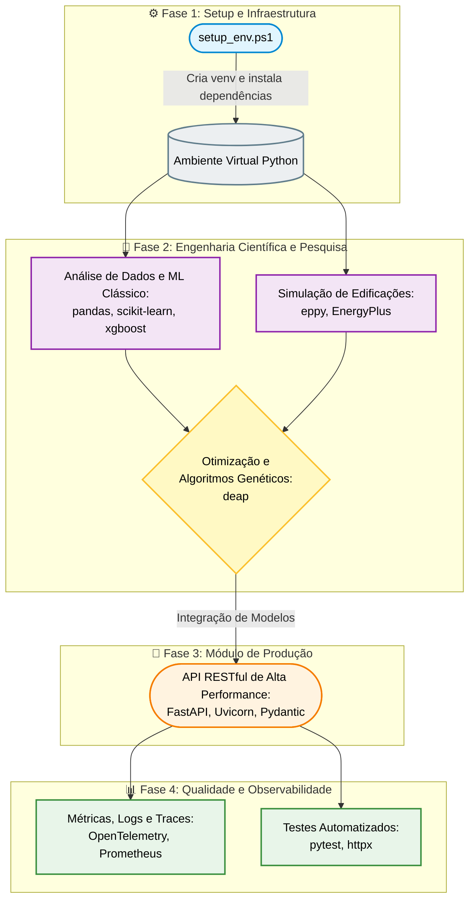
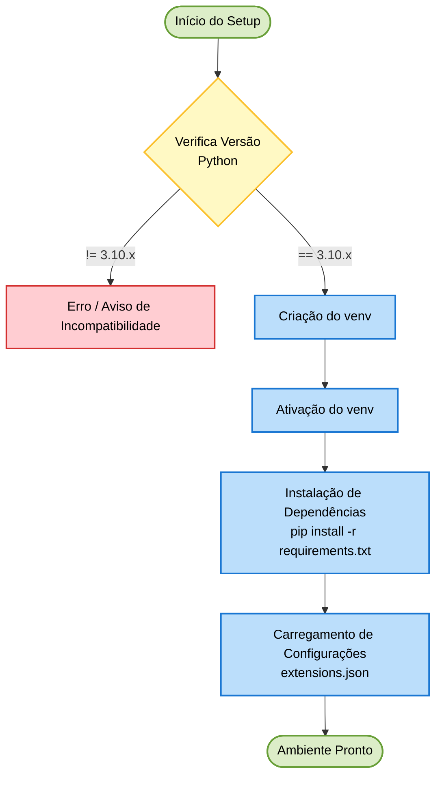
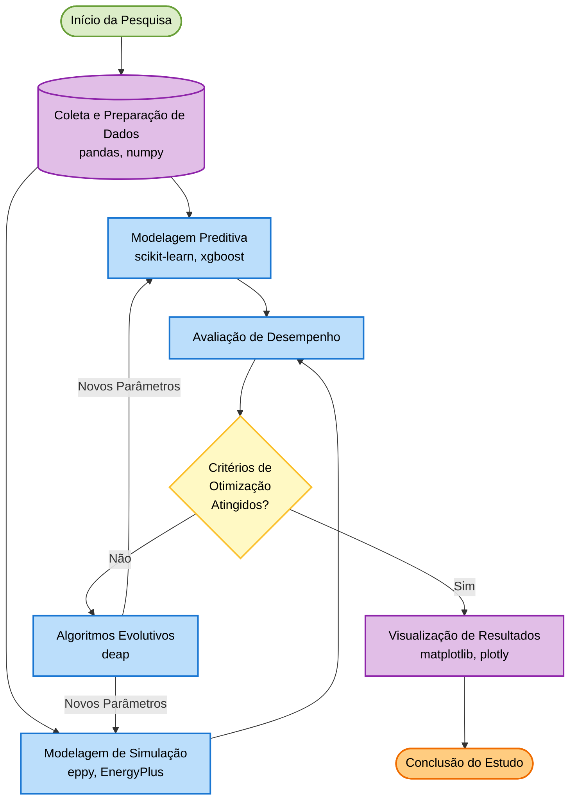
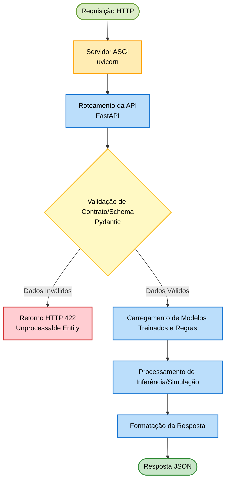
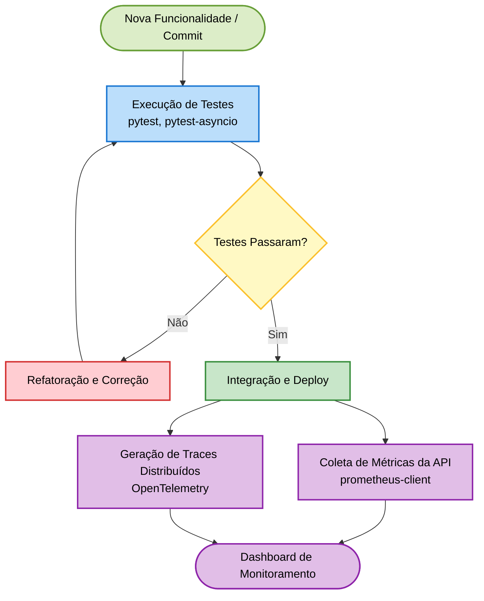

# 📘 Guia de Referência Completo: Workflows e Glossário

Este documento centraliza a arquitetura de trabalho do projeto, os diagramas de execução e o vocabulário técnico fundamental, servindo como o manual definitivo para os alunos do treinamento *Scientific AI Engineering*.

## 🎯 Objetivo do Guia

Este guia foi criado para acelerar onboarding, padronizar a execução técnica e reduzir ambiguidades entre pesquisa científica e engenharia de software.

## 🧭 Como Usar Este Documento

1. Leia a **Parte 1** para entender a visão sistêmica do projeto.
2. Consulte a **Parte 2** para executar cada fase com sequência operacional clara.
3. Use a **Parte 3** como referência rápida de termos técnicos durante estudos, implementação e revisão.

---

## 🗺️ Parte 1: Arquitetura e Fluxo de Trabalho Principal

O ciclo de vida e a arquitetura de trabalho do projeto estão estruturados em quatro fases principais.

### 1.1 Diagrama Macroscópico

### 1.2 Descrição das Fases

1. **Fase 1: Setup e Infraestrutura:** Garante um ambiente reprodutível e isolado utilizando PowerShell e o gerenciador de pacotes pip.
2. **Fase 2: Engenharia Científica e Pesquisa:** O núcleo analítico do projeto. Aqui, combinamos simulação física (EnergyPlus via `eppy`) com machine learning e algoritmos evolutivos (`deap`) para experimentação e busca de soluções ótimas.
3. **Fase 3: Módulo de Produção:** Transforma os scripts de pesquisa em um produto de software escalável, expondo a lógica por meio de uma API construída com `FastAPI`.
4. **Fase 4: Qualidade e Observabilidade:** Garante que a aplicação em produção está saudável, instrumentando a API para expor métricas e validando a lógica continuamente por meio de testes assíncronos com `pytest`.

---

## 🔍 Parte 2: Detalhamento dos Fluxos de Trabalho (Sub-workflows)

Esta seção expande as fases definidas no fluxo principal, detalhando os processos e bibliotecas envolvidas em cada etapa do ciclo de vida da aplicação.

### Fase 1: Setup e Infraestrutura
Detalha o processo de inicialização do ambiente de desenvolvimento local.

**Detalhamento das Etapas:**
- **Verifica Versão Python**: Checagem de segurança (guardrail) inicial. Garante que se esteja usando a versão *3.10.x* exigida, prevenindo quebras em bibliotecas sensíveis de Machine Learning.
- **Criação e Ativação do venv**: Instanciação de um ambiente local seguro (*sandbox*), exclusivo para as pesquisas do projeto.
- **Instalação de Dependências**: Etapa que lê o arquivo `requirements.txt` e faz o download automático de pacotes como Pandas, Scikit-Learn e Eppy.
- **Carregamento de Configurações**: Inicialização de chaves da API, variáveis de ambiente ou arquivos estruturais de contexto (ex: `.json`).

---

### Fase 2: Engenharia Científica e Pesquisa
Descreve o loop de experimentação, combinando simulação termodinâmica e aprendizado de máquina guiado por algoritmos genéticos.

**Detalhamento das Etapas:**
- **Coleta e Preparação de Dados**: Fase de estruturação das variáveis e amostragem de dados (ex: usando *Latin Hypercube Sampling*) focando no clima e na geometria.
- **Modelagem Preditiva**: Treinamento do Modelo Substituto (*Surrogate Model* - XGBoost) capaz de prever os resultados termodinâmicos de forma virtualmente instantânea.
- **Modelagem de Simulação**: Acionamento bruto (Ground-Truth) do EnergyPlus para simular cenários complexos onde a física exata não pode ser apenas "estimada".
- **Avaliação de Desempenho**: Comparativo dos retornos simulados/previstos contra os alvos estabelecidos (conforto térmico da ASHRAE, orçamentos e consumo energético).
- **Algoritmos Evolutivos**: Processo de otimização automatizado. A biblioteca de IA realiza cruzamentos e mutações matemáticas para buscar configurações imobiliárias mais eficientes.
- **Visualização de Resultados**: Geração dos outputs científicos do pesquisador, plotando fronteiras de Pareto e gráficos de convergência térmica.

### Fase 3: Módulo de Produção
Ilustra como os modelos e simulações são encapsulados e disponibilizados por meio de uma API.

**Detalhamento das Etapas:**
- **Servidor ASGI / Roteamento (uvicorn/FastAPI)**: O motor web que fica "ouvindo" ativamente novas conexões e distribui requisições (`/simulate`, `/predict`) de maneira assíncrona.
- **Validação de Contrato/Schema**: Etapa de Guardrail com `Pydantic`. Garante estritamente que os dados recebidos façam sentido físico (ex: impede a entrada de um WWR negativo ou espessura irreal).
- **Carregamento de Modelos Treinados e Regras**: Carrega para a memória (RAM) todos os modelos de IA e configurações de contexto antes de calcular a resposta.
- **Processamento de Inferência/Simulação**: O momento onde a matemática acontece, seja acionando a rede neural rápida ou inicializando um motor físico lento para processar o pedido.
- **Formatação da Resposta**: Padronização da saída do sistema empacotada em formato JSON, devolvendo ao usuário os diagnósticos de forma limpa.

### Fase 4: Qualidade e Observabilidade
Mostra os processos contínuos que garantem a estabilidade e monitoramento do código em produção e durante o desenvolvimento.

**Detalhamento das Etapas:**
- **Execução de Testes**: Rodada agressiva de scripts validadores para testar desde uma função matemática simples até cenários de ponta-a-ponta, prevenindo que código falho siga em frente.
- **Integração e Deploy**: Empacotamento sistemático de toda a aplicação usando arquitetura de contêineres e envio contínuo das novas versões aos servidores.
- **Coleta de Métricas da API**: Leitura sistêmica de uso da CPU, tempo de latência de respostas e taxa de erros gerados pelas interações dos usuários.
- **Geração de Traces Distribuídos**: Mapeamento do caminho exato (trace) e tempo que uma requisição gastou em cada linha do projeto (ex: de quanto tempo o LLM gastou "pensando" até quanto a física gastou "simulando").
- **Dashboard de Monitoramento**: Uma interface visual tática (ex: Grafana) permitindo ao pesquisador/engenheiro avaliar a saúde completa da arquitetura na Nuvem.

---

## 📚 Parte 3: Glossário Técnico Completo

Este glossário consolida os principais termos e conceitos abordados ao longo dos 12 meses do treinamento, cobrindo as interseções entre Física de Edificações, Inteligência Artificial, LLMs e Engenharia de Software.

### 🏢 3.1 Simulação Termodinâmica & BPS (Building Performance Simulation)

- **BPS (Building Performance Simulation)**: Uso de modelos computacionais para prever o desempenho de uma edificação (energia, conforto térmico, iluminação, etc.) com base em leis físicas.
- **EnergyPlus**: Motor de simulação de código aberto desenvolvido pelo DOE (Department of Energy - EUA), considerado o padrão-ouro mundial para modelagem energética de edifícios.
- **Zone (Zona Térmica)**: Um volume de ar dentro de um edifício (como uma sala ou conjunto de salas) que é modelado assumindo temperatura e propriedades termodinâmicas uniformes.
- **Surface (Superfície)**: Elemento construtivo (parede, teto, piso, janela) que delimita uma zona térmica e participa ativamente da transferência de calor.
- **WWR (Window-to-Wall Ratio / Proporção Janela-Parede)**: A proporção da área envidraçada em relação à área total de uma fachada externa. Fundamental para o cálculo de ganhos solares e perdas térmicas.
- **Thermal Conductivity (Condutividade Térmica - λ ou k)**: Propriedade do material que indica sua capacidade de conduzir calor, medida em W/m·K. Quanto menor, melhor o material age como isolante.
- **U-Value (Coeficiente Global de Transferência de Calor)**: Mede o quão bem um elemento construtivo conduz o calor. Expressa a taxa de transferência térmica por meio de uma estrutura inteira (W/m²·K). Valores baixos indicam bom isolamento.
- **R-Value (Resistência Térmica)**: O inverso do U-Value (R = 1/U). Indica a resistência de um material ao fluxo de calor. Valores altos indicam bom isolamento.
- **SHGC (Solar Heat Gain Coefficient)**: Fração da radiação solar incidente que entra por uma janela. Varia de 0 a 1, onde valores menores bloqueiam mais calor (ideal para climas quentes).
- **ACH (Air Changes per Hour / Taxa de Infiltração)**: Medida de quantas vezes o volume total de ar de uma zona térmica é substituído pelo ar exterior não-condicionado em uma hora.
- **Weather File (EPW)**: Arquivo que contém os dados climáticos horários de um local específico para um ano inteiro (temperatura, radiação solar, umidade, ventos), usado para rodar as simulações.
- **PMV (Predicted Mean Vote)**: Índice de conforto térmico que prevê a avaliação média de um grande grupo de pessoas em um ambiente. A escala vai de -3 (muito frio) a +3 (muito quente), sendo 0 o estado de conforto neutro ideal.

### 🧠 3.2 Machine Learning & PIML (Physics-Informed Machine Learning)

- **PIML (Physics-Informed Machine Learning)**: Abordagem que integra as leis da física (ex: conservação de energia, termodinâmica) aos algoritmos de Machine Learning, reduzindo o espaço de busca e garantindo predições realistas.
- **Surrogate Model (Modelo Substituto)**: Um modelo de aprendizado de máquina treinado para imitar o comportamento de um simulador complexo e lento (como o EnergyPlus). Pode rodar até 1000x mais rápido mantendo alta precisão.
- **XGBoost (Extreme Gradient Boosting)**: Algoritmo de árvores de decisão impulsionadas em gradiente, amplamente utilizado no curso por sua alta precisão, rapidez de treinamento e interpretabilidade para dados tabulares de engenharia.
- **MLP (Multilayer Perceptron)**: Um tipo clássico de rede neural artificial feedforward, usada como modelo substituto capaz de mapear relações físicas altamente não-lineares.
- **LHS (Latin Hypercube Sampling)**: Método estatístico de amostragem que garante uma distribuição mais uniforme e representativa das variáveis de entrada do que o método aleatório simples. Crucial para gerar os datasets de simulação.
- **Cross-Validation (Validação Cruzada)**: Técnica de particionamento de dados usada para testar o quão bem um modelo de ML generaliza para dados novos, ajudando a identificar *overfitting* (sobreajuste).
- **Epistemic Uncertainty (Incerteza Epistêmica)**: Incerteza resultante da falta de conhecimento sobre o modelo ou falta de dados. Pode ser reduzida treinando o modelo com mais dados (ex: zonas não exploradas do espaço paramétrico).
- **Aleatoric Uncertainty (Incerteza Aleatória)**: Incerteza inerente ao processo ou ao ruído dos dados (ex: variabilidade climática ou medições de sensores imperfeitas). Não diminui com mais dados.

### 💬 3.3 LLMs & Prompt Engineering Científico

- **LLM (Large Language Model)**: Redes neurais gigantescas treinadas em vastos volumes de texto (como o Google Gemini). No nosso currículo, agem como agentes de raciocínio capazes de traduzir intenções humanas em parâmetros de engenharia.
- **Prompt Engineering (Engenharia de Prompts)**: O processo de estruturar o texto fornecido ao LLM para otimizar as respostas. Inclui o uso de contextos, *roles* (papéis) definidos e restrições.
- **System Prompt (Prompt de Sistema)**: Uma instrução "escondida" que define as diretrizes fundamentais, a persona do modelo (ex: Engenheiro especialista em ASHRAE) e impõe guardrails (restrições lógicas e normativas).
- **Few-Shot Learning**: Técnica em Prompt Engineering que envolve fornecer ao modelo exemplos explícitos de entradas (perguntas) e saídas desejadas (respostas estruturadas) para "ensinar" o padrão esperado de raciocínio.
- **Hallucination (Alucinação)**: Fenômeno onde o LLM gera informações de forma confiante, porém falsas ou fisicamente impossíveis (ex: U-value negativo ou citando normas inexistentes). Combatido via *Physics Violation Detectors*.
- **Function Calling (Tools)**: Recurso que permite que o LLM chame diretamente funções determinísticas em Python (como acionar o modelo Surrogate ou consultar o clima) no meio da resposta, combinando linguagem natural com computação hard.
- **TTFT (Time to First Token)**: Métrica de latência importante em fluxos de IA conversacionais que mede o tempo levado entre o envio da requisição e o recebimento da primeira "fatia" (token) de resposta.
- **TPS (Tokens Per Second)**: Métrica que define a velocidade da geração (streaming) de resposta do LLM, impactando diretamente na experiência do usuário.

### ⚙️ 3.4 Engenharia de Software Científica & MLOps

- **Co-Simulation (Co-simulação)**: A técnica de acoplar múltiplos simuladores ou módulos resolvendo dependências de tempo e dados no mesmo *loop* (neste caso, trocando informações entre EnergyPlus, XGBoost Surrogate e Agente Gemini).
- **Golden Dataset**: Um conjunto imutável de testes validado manualmente e considerado como "verdade absoluta" (Baseline). Ele é usado para atestar regressões e testar se os componentes físicos/LLMs não estão errando o básico.
- **Traceability Matrix (Matriz de Rastreabilidade)**: Um artefato que cruza os casos de teste criados contra os requisitos do sistema (ex: ASHRAE 90.1 compliance), garantindo que nada fique sem testar (Coverage 100%).
- **Design Patterns (Padrões de Projeto)**: Soluções típicas para problemas comuns de software. Exemplos usados no curso: *Strategy* (alternar entre surrogates e EnergyPlus), *Observer* (registrar métricas/violações) e *Factory* (instanciar simuladores).
- **Pydantic**: Biblioteca do ecossistema Python que força *type hints* e faz validação robusta de esquemas de dados em tempo de execução, fundamental para validar os JSONs gerados pelo LLM.
- **GitOps**: Uma prática de DevOps que utiliza os repositórios Git como fonte única da verdade para a infraestrutura declarativa e as aplicações, muito utilizada com Kubernetes (ArgoCD) para realizar deployments.
- **Containerization (Docker)**: Empacotamento do código do modelo de ML, código do servidor e dependências em um único "recipiente" isolado (imagem Docker), eliminando o problema do "na minha máquina funciona".
- **Orchestration (Kubernetes/K8s)**: Sistema responsável por gerenciar centenas ou milhares de containers Docker, reiniciando pods que falham e garantindo balanceamento de carga da API do nosso motor de co-simulação.